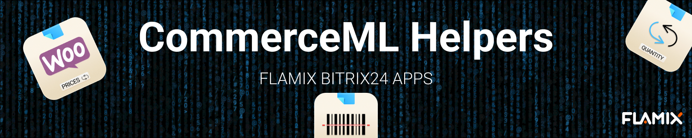
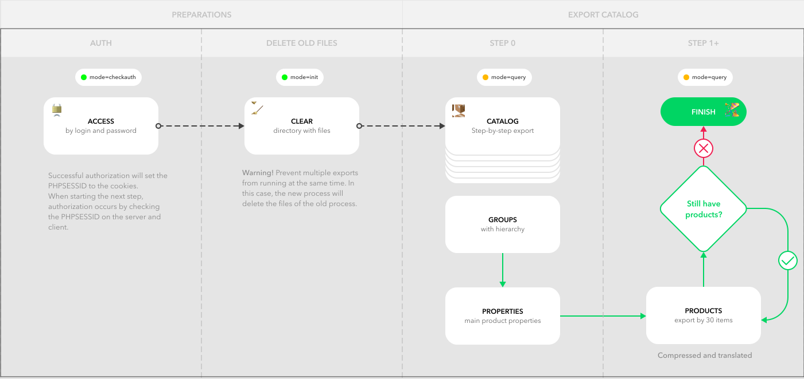

# About

This package is intended for integration of product synchronization applications from FLAMIX.
The package uses a simplified and improved version of the CommerceML exchange protocol.

## Philosophy of Sync

* Adding, editing, parsing, and deleting products, catalogs, and fields are carried out only on the site;
* Bitrix24 synchronizes the catalog structure and products with fields;
* Bitrix24 synchronizes product rests and prices to the site;

Warning! Bitrix24 does not upload the catalog and products to the website.


## Concept Guides

We use CommerceML standards, but in order to simplify the exchange and in line with our sync philosophy, the following logical concepts have been adopted:

* Main language - English (in some places it is translated into Russian to maintain backward compatibility);
* Synchronization occurs step by step, 30 products per step;
* After import, the import file is automatically deleted;
* All data is compressed via zip;
* If you need stop actions use ``throw new \Exception('Your message');``

## API and Actions

Inventory API and sync actions - https://inventory.app.flamix.solutions/docs

Can be imported and used as a Postman collection or OpenAPI Spec.

## Install and usage

```php
composer require flamix/commerceml
```

Create new class

```php
<?php
/**
* Redefining how the plugin works
* If something is not clear, see how it is done in the parent class Flamix\CommerceML\Init
*/
namespace My\CMS;

use Flamix\CommerceML\Init;

class Exchange extends Init {
    /**
    * CALLBACKS
    * 
    * Called on export  
    * The export action calls these callbacks to get arrays of properties to be wrapped in xml
    * @axample public static function get(int $page, array $params = []): array
    * Note! Every callback must return EXTERNAL_ID as ID, and automatically create it, if it's empty or non exist
    * Note! $page will be passed automatically
    */
    protected static string $product_callback = '\Exchange\Woo\Products';
    protected static string $category_callback = '\Exchange\Woo\Categories';
    protected static string $attribute_callback = '\Exchange\Woo\Attributes';

    /**
    * ACTIONS
    * 
    * If you need to override the behavior of a standard action
    * For example, it is almost always necessary to override the authorization action behaviors
    */
    public static function actionCheck()
    {
        if (Setting::getOption('lead_domain') !== ($_SERVER['PHP_AUTH_USER'] ?? ''))
            throw new \Exception('Bad login!');

        if (Setting::getOption('lead_api') !== ($_SERVER['PHP_AUTH_PW'] ?? ''))
            throw new \Exception('Bad password!');

        // If OK - Print our session_id
        return CheckAuth::printPhpSession();
    }

    /****************** | HANDLERS | *******************/
    /**
    * HANDLERS (restsHandler, pricesHandler and productsHandler)
    * 
    * Called on import
    * If you need to override the behavior of a standard action
    * For example, it is almost always necessary to override the authorization action behaviors
    */
    public static function restsHandler($product_id, array $rests): bool
    {
        $woo_id = Products::getProductBy('EXTERNAL_ID', $product_id);
        commerceml_log('[restsHandler] Product ' . (($woo_id) ? 'founded with WooCommerce product ID ' . $woo_id : 'not found') . ' by EXTERNAL_ID: ' . $product_id, $rests);
        if (!$woo_id)
            return false;

        $general_quantity = array_sum(array_column($rests, 'quantity'));
        commerceml_log('[restsHandler] General quantity by all warehouses ' . $general_quantity);

        if (!$general_quantity)
            return false;

        // dd($woo_id, $general_quantity, $rests);
        return Products::set($woo_id, ['quantity' => $general_quantity]);
    }
}
```

Init sync

```php
// Init main settings and include helpers
\Flamix\Sync\Init::init(__DIR__);

// Start exchange
// \My\CMS\Exchange replace to your class
if (($_GET['flamix_product'] ?? false) === 'Y')
    \My\CMS\Exchange::start();
```

### Export: Products, category and fields from site to CRM



